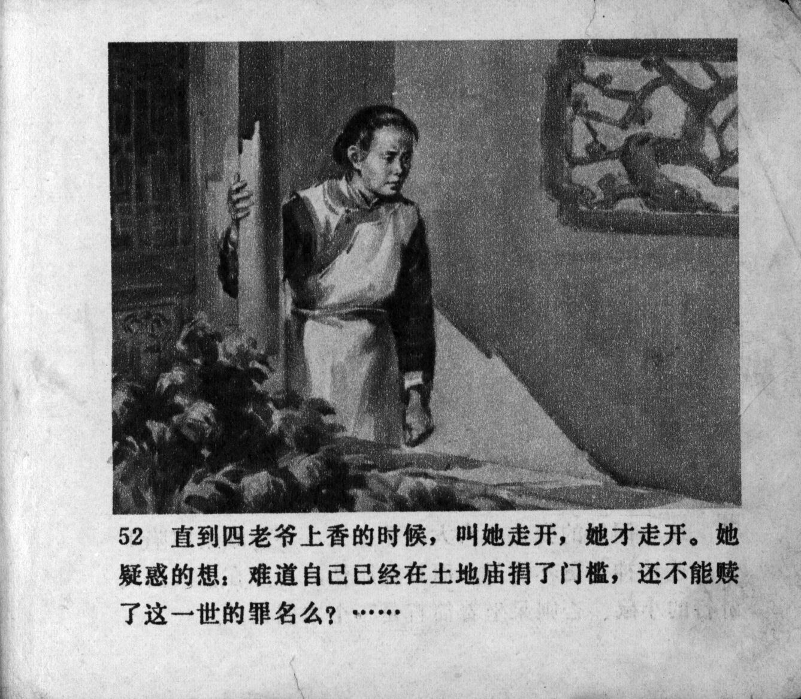



直到四老爷上香的时候，叫她走开，她才走开。她疑惑的想：难道自己已经在土地庙捐了门槛，还不能赎了这一世的罪名么？……

<--->

Only when Mr. Lu burned the joss sticks and ordered her to leave did she leave. Feeling uncertain, she thought: Could it be that despite having already paid for a threshold in contribution to the village temple, she still could not redeem herself from the sins of this life? … 


