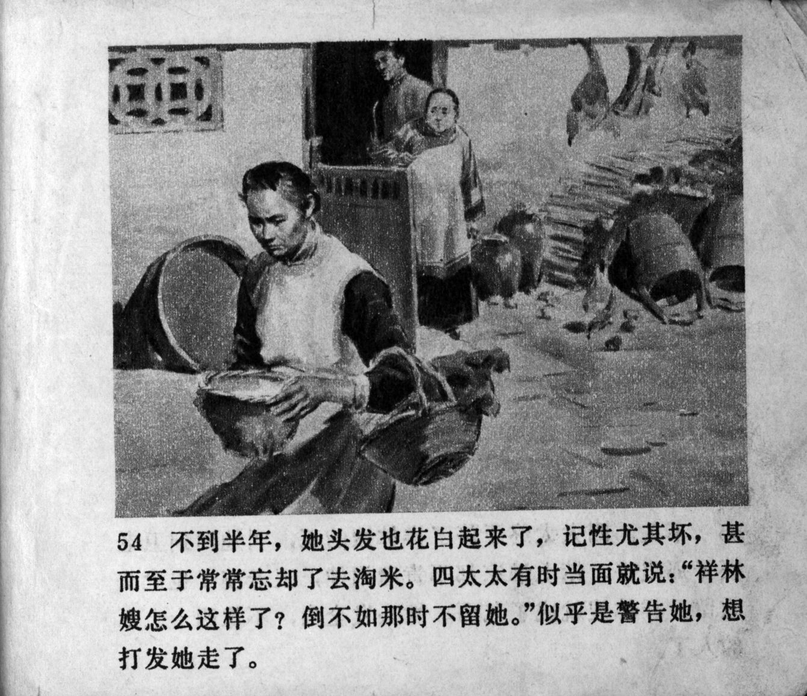



不到半年，她头发也花白起来了，记性尤其坏，甚而至于常常忘却了去淘米。四太太有时当面就说：“祥林嫂怎么这样了？倒不如那时不留她。”似乎是警告她，想打发她走了。

<--->

Within half a year, her hair started to turn white, her memory became particularly poor, even to the point that she frequently forgot to go and rinse rice. Mrs. Lu sometimes said right in front of her: "How come Xianglin's wife becomes like this? It would have been better if we hadn't kept her." It was as if she was warning her that she wanted to dismiss her.


