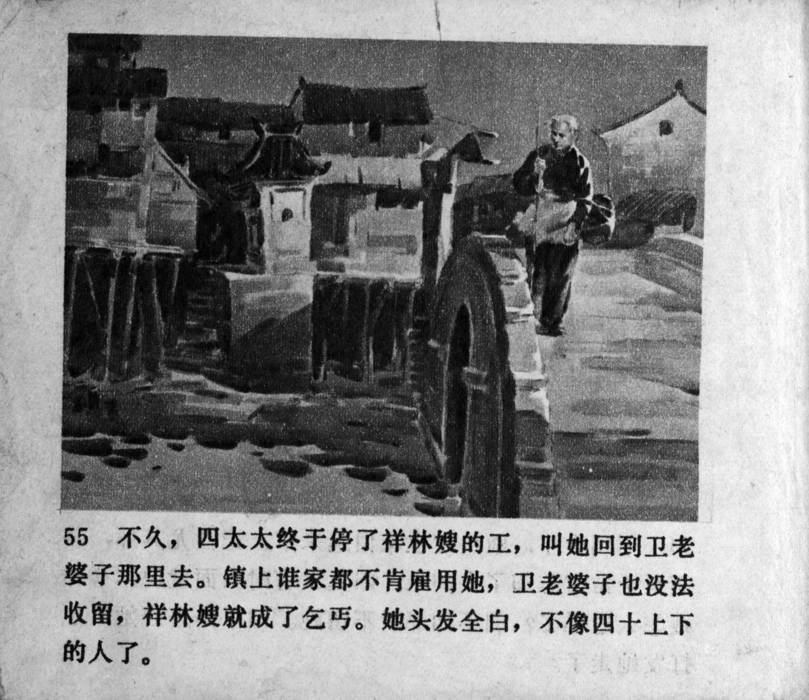



不久，四太太终于停了祥林嫂的工，叫她回到卫老婆子那里去。镇上谁家都不肯雇用她，卫老婆子也没法收留，祥林嫂就成了乞丐。她头发全白，不像四十上下的人了。

<--->

Before long, Mrs. Lu finally suspended Xianglin's wife's work and told her to return to Old Wei's. No household in town was willing to employ her, and Old Wei was unable to take her in, so Xianglin's wife became a beggar. Her hair turned completely white, and she did not look like a person in their forties anymore.


