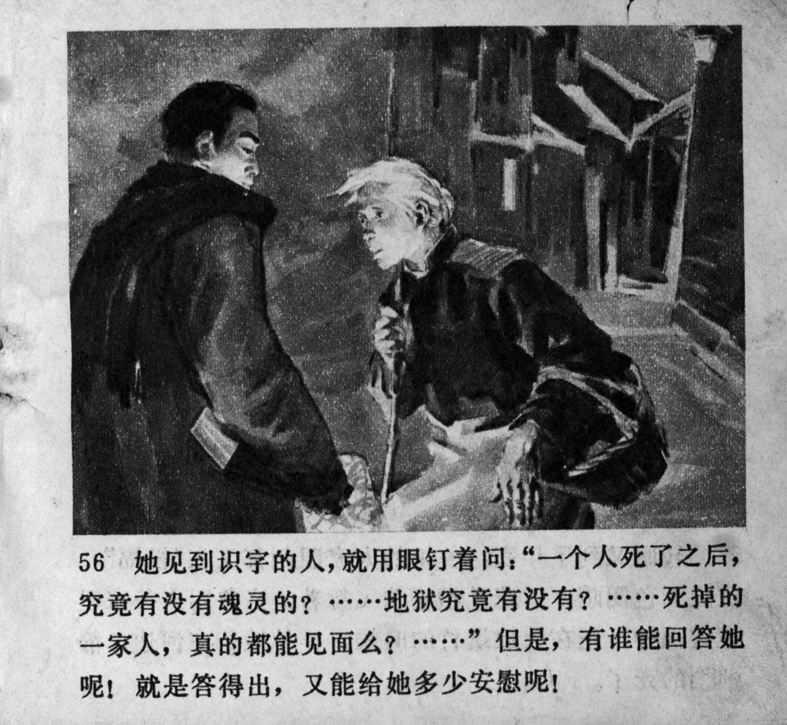



她见到识字的人，就用眼钉着问：“一个人死了之后，究竟有没有魂灵的？……死掉的一家人，真的都能见面么？……”但是，有谁能回答她呢！就是答得出，又能给她多少安慰呢！

 <--->

When she came across someone literate, she fixed her stare at him and asked: "When a person dies, do they actually have a soul? ... Dead families, can they truly meet each other? ... " But, who could answer her! Even if they gave an answer, how much comfort could this give her!


